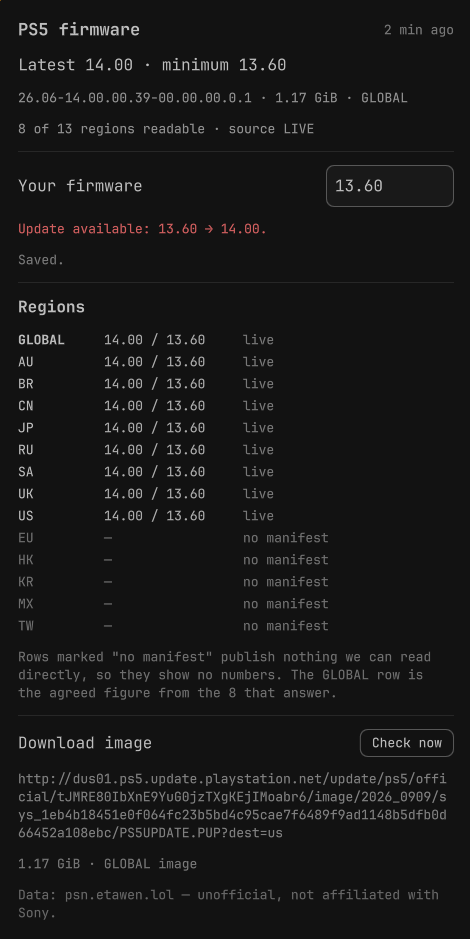

# PS5 firmware for the Omarchy bar

Watches the PlayStation 5 firmware manifests and speaks up only when something actually changes: a new latest
version, a raised force-update minimum, a region losing coverage, or the same version rebuilt as a new image.
It puts the PlayStation mark in your bar, keeps a panel with the details, and sends one notification that is
updated in place, so a monitor that runs for months does not leave a wall of toasts behind it.



## What you get

- A PlayStation mark in the bar (from Simple Icons), tinted to your theme. It follows the state rather than a
  fixed colour: normal ink while the reading is quiet, the theme's urgent colour when something changed in the
  last day, and dimmed when the source stops answering.
- A tooltip with the newest reading and what each click does.
- Left click opens the panel. Middle click checks now.
- One notification, updated in place with `-r <id>`, when a real change happens. One toast at a time, not one
  per check.
- A panel with the latest and the minimum, the build hash and image size, how many regions answered, the full
  region matrix, the download link for the newest image, and a field where your own firmware version is
  compared against the minimum and the latest.

## Requirements

Omarchy, which is what makes both halves of this plugin work: a `bar-widget` and a `service`, running inside
`omarchy-shell`. Plus `bash`, `curl` and `jq`. `jq` is a declared dependency of the Omarchy package and `curl`
is on any Omarchy install, so there is nothing extra to install. No Node, no Python, no daemon of its own: the
service is a timer inside the shell.

## Install

```sh
omarchy plugin add https://github.com/DanielErikssonCoder/omarchy-ps5-firmware --enable
```

Without `--enable` the plugin is installed but off, and you can turn it on where you want it:

```sh
omarchy plugin enable io.github.danielerikssoncoder.ps5-firmware right
```

To run a clone you already have, copy the folder into `~/.config/omarchy/plugins/` and run
`omarchy-shell shell rescanPlugins`.

The first reading lands a few seconds after the shell starts. Nothing is fetched while the bar draws: the
helper script owns the network and the widget only ever reads a file.

## Settings

All five live in the widget's own settings (the bar's settings UI, or `~/.config/omarchy/shell.json`).

| Setting | Default | What it does |
|---|---|---|
| Check interval (minutes) | 30 | How often the manifest is read. The public API caches its own answers for 30 minutes, so checking much faster mostly repeats the same numbers. |
| Region on the bar | GLOBAL | The scope the bar, the tooltip and the notification follow. GLOBAL is the agreed figure across the regions that answer; a single region follows only that manifest. |
| Your firmware | empty | The version your console runs, for example `13.60`. The panel compares it with the minimum and the latest. |
| Notify when firmware changes | on | One notification, updated in place, for the four changes below. |
| Notify when the source stops answering | on | Only after four failed checks in a row, never on a single hiccup. |

EU, KR, MX, TW and HK publish no manifest that can be read directly. Those rows in the panel show a placeholder
instead of numbers, because a borrowed figure would be a guess, and the GLOBAL row directly above them is the
best answer available.

## When it notifies

Exactly four things, each announced once:

1. A new latest version.
2. The minimum raised, meaning the oldest version PSN still serves went up.
3. A region that stops being readable.
4. The same version rebuilt: version and minimum unchanged, but the image behind the download link has a new
   build hash.

Nothing else does. A check that finds the same numbers sends nothing, and a change is never announced twice.
The source going quiet is the fifth reason, at low urgency, and only after four failed checks in a row.

## Where its data lives

The helper writes one file, and the bar, the panel and the command line all read that same file:

```
~/.local/state/omarchy/plugins/io.github.danielerikssoncoder.ps5-firmware/state.json
```

Every rule lives in `bin/ps5-firmware` and `lib/*.jq`. The QML draws what that file says and decides nothing
itself, so the panel cannot show a different truth from the one that sent the notification. Removing the plugin
leaves the file behind on purpose: it is a reading, not a setting. Delete the folder if you want a clean slate.

## Command line

The same script the service runs, useful on its own:

```sh
bin/ps5-firmware --once                  # read the manifest, compare, write the state file
bin/ps5-firmware --once --json           # the whole state file on stdout
bin/ps5-firmware --print                 # what the state file says now, no network
bin/ps5-firmware --once --no-notify      # record what changed, send nothing
bin/ps5-firmware --region US --once      # one region instead of the setting
bin/ps5-firmware --once --source ./tests/fixtures/manifest-2026-09-25.json
```

Exit 0 means the run happened, whether or not the source answered: a monitor that cannot reach its source must
record that, not crash the thing that called it. Exit 2 is a usage error and exit 3 is a bug worth reporting.
`--help` lists the rest.

## Tests

```sh
./tests/run.sh
```

54 cases, none of which need the network. `tests/fixtures/` holds a real API reply from 2026-09-25 plus four
variants that each change exactly one thing, so a failing test points at a single rule instead of at a pile of
data. The suite never touches the desktop it runs on: every notification goes to a stand-in under
`tests/support/` and the assertions are made against what would have been sent.

## Data source, credits and trademarks

The readings come from [psn.etawen.lol](https://psn.etawen.lol) (`/api/manifest`), an unofficial aggregator
that reads Sony's own update manifests. All credit for the data is theirs. This plugin only watches it, adds
the comparison and decides when you want to hear about it.

This plugin is unofficial and not affiliated with, endorsed by or connected to Sony Interactive Entertainment.
"PlayStation" and the PlayStation mark are trademarks of Sony. The mark drawn in the bar comes from
[Simple Icons](https://simpleicons.org): the file is CC0, the mark itself is not. It is here to say what the
widget watches, nothing more.

## License

MIT, see [LICENSE](LICENSE).
